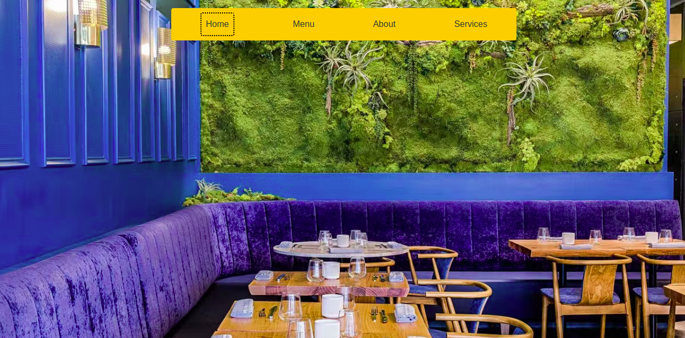

# Restaurant-page
This project is about a simple Restaurant page  application . The purpose of the project is teach learners to how to build a toggle navbar Usng Javascript solely and to arrange code in different modules
for exportation and importation 
 

## Built With

- HTML & CSS
- BOOTSTRAP FRAMEWORK
- Javasript

## Getting started
   To get a local copy up and running follow these simple example steps.
# Setup
- Clone the project locally.
- Type the command `cd Restaurant-page`
- Use any browser of your choice, copy the absolute path of the  `index.html` and type in the search bar
## Live Demo

- [Live Demo Link](https://che30.github.io/Restaurant-page/)
 

## Author
**Che Blanchard**

- GitHub: [@che30](https://github.com/che30)
- LinkedIn: [Che Blanchard](https://www.linkedin.com/in/che-nsoh-9455271b0/)
- Twitter:[che55085128](https://twitter.com/che55085128)

## Acknowledgements
- The next web
- W3 schools
- Font awesome
- Stack overflow

##  Contributing

Contributions, issues, and feature requests are welcome!

## Show your support

Give a ⭐️ if you like this project!

## License

This project is [MIT](./LICENSE.txt) licensed.